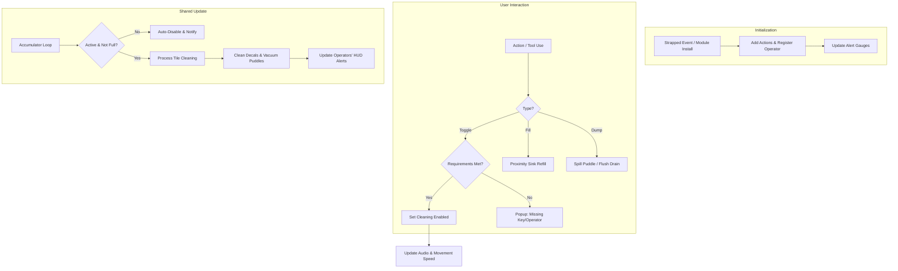

# Floor Scrubber Feature - System Outline

This document provides a comprehensive overview of the Floor Scrubber feature, its file structure, and its current implementation state. The system has been refactored for modularity to support both vehicles and cyborg chassis.

## File Locations

### 1. Game Logic & Components
- [SharedFloorScrubberSystem.cs](file:///o:/games/monolith%20server/Goob-Station/Content.Goobstation.Shared/Vehicles/FloorScrubber/SharedFloorScrubberSystem.cs) — **Core Engine**: Handles tile cleaning, vacuuming, and tank synchronization.
- [FloorScrubberComponent.cs](file:///o:/games/monolith%20server/Goob-Station/Content.Goobstation.Shared/Vehicles/FloorScrubber/FloorScrubberComponent.cs) — **Feature Data**: Stores volumes, rates, ranges, and state.
- [FloorScrubberToolComponent.cs](file:///o:/games/monolith%20server/Goob-Station/Content.Goobstation.Shared/Vehicles/FloorScrubber/FloorScrubberToolComponent.cs) — **Tool Bridge**: Allows borgs to control internal systems via held items.
- [FloorScrubberActions.cs](file:///o:/games/monolith%20server/Goob-Station/Content.Goobstation.Shared/Vehicles/FloorScrubber/FloorScrubberActions.cs) — **Events**: Action and DoAfter definitions.
- [BorgModuleFloorScrubberComponent.cs](file:///o:/games/monolith%20server/Goob-Station/Content.Goobstation.Shared/Vehicles/FloorScrubber/BorgModuleFloorScrubberComponent.cs) — **Marker**: Component for the borg module entity.
- [BorgFloorScrubberSystem.cs](file:///o:/games/monolith%20server/Goob-Station/Content.Goobstation.Server/Vehicles/FloorScrubber/BorgFloorScrubberSystem.cs) — **Borg Integration**: Handles module installation and solution tank injection.

### 2. Prototypes (YAML)
- [floorscrubber.yml](file:///o:/games/monolith%20server/Goob-Station/Resources/Prototypes/_Goobstation/_Floorscrubber/Vehicles/floorscrubber.yml) — Basic vehicle and keys.
- [floorscrubber_ actions.yml](file:///o:/games/monolith%20server/Goob-Station/Resources/Prototypes/_Goobstation/_Floorscrubber/Vehicles/floorscrubber_actions.yml) — UI Actions.
- [floorscrubber_borg_module.yml](file:///o:/games/monolith%20server/Goob-Station/Resources/Prototypes/_Goobstation/_Floorscrubber/Borg/floorscrubber_borg_module.yml) — Borg module and tool entities.
- [floorscrubber_alerts.yml](file:///o:/games/monolith%20server/Goob-Station/Resources/Prototypes/_Goobstation/_Floorscrubber/Alerts/floorscrubber_%20alerts.yml) — HUD Gauge alerts.

### 3. Localization
- [floorscrubber.ftl](file:///o:/games/monolith%20server/Goob-Station/Resources/Locale/en-US/_Goobstation/Vehicles/floorscrubber.ftl)

---

## Logic Flow

## System Analysis & Quality Audit

### [x] Architecture: Modular Refactor
The system was recently decoupled from the `Vehicle` entity. It now uses a list of `ActiveOperators` to determine who receives HUD updates and can trigger actions. This allows the same logic to work for:
-   **Vehicles**: Uses `StrappedEvent` to add/remove operators.
-   **Cyborgs**: Registers the borg as the operator upon module installation via `BorgFloorScrubberSystem`.

### [x] Convention Compliance
- **XML Documentation**: All public systems and components now feature complete `///` documentation for members and methods.
- **Project Structure**: All files have been moved from core `Content.Shared` / `Content.Server` to `Goobstation` specific subfolders to prevent merge conflicts with upstream.

### [x] Performance Optimizations
- **Audio Throttling**: Looping audio streams are managed via `SetCleaningEnabled` and `OnInsert` events rather than every frame in the `Update` loop.
- **Alert Efficiency**: Alerts are updated specifically when solutions change (Fill/Dump/Cleaning Cycle) rather than on a periodic timer, removing the need for a separate gauge accumulator.
- **Throttled Logic**: The cleaning cycle runs on a configurable `CleaningInterval` (default 0.33s) to minimize spatial lookup overhead.

### [!] Potential Improvements
- **Grid Persistence**: The line-cleaning shape snaps to cardinal directions. For high-speed vehicles, this might lead to missed tiles if the velocity is high enough to skip intervals.
- **Solution Synchronization**: While `UpdateAlerts` is called after cleaning, very frequent puddles may trigger multiple solution changes per tick. Throttling gauge updates slightly might be beneficial if dozens of scrubbers are active.
